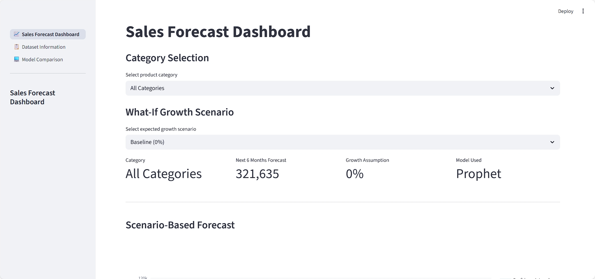

# Sales Forecast Dashboard
**A machine learning application that helps retail businesses forecast their future sales based on the historical transaction data.**

This system provides a predictive analytics dashboard that enables businesses to evaluate growth scenarios for the next 6 months, identify upcoming trends, and optimize strategic decision-making based on historical sales patterns.

**This project has be made over <a href="https://www.kaggle.com/datasets/vivek468/superstore-dataset-final">Superstore Sales Dataset</a> and uses <a href="https://facebook.github.io/prophet/">Facebook Prophet</a> model for forecasting.**

# Problem Statement
The task is to provide an AI-Powered Sales Forecast Dashboard which provides:
1. Sales trend line with actual vs. forecasted data
2. Monthly & yearly comparisons
3. Filters by category/store/region'
4. Highlight top-selling items & low seasons
5. Insight cards for decision-making

# System Requirements
1. Operating System: Windows / Linux / macOS
2. Python version: 3.9+

# Dependencies
## Standard Python Libraries
1. <code>logging</code>:- For logging processes.
2. <code>pathlib</code>:- For holding paths.
3. <code>pickle</code>:- For storing Python objects.

## Third Party Libraries
1. <code>prophet</code>:- For time series forecasting.
2. <code>pandas</code> and <code>numpy</code>:- For working with datasets and csv files.
3. <code>matplotlib</code>, <code>plotly</code> and <code>seaborn</code>:- For dataset visualization and graphs.
4. <code>scikit-learn</code>:- For data preprocessing, classification model and benchmarking.
5. <code>streamlit</code>:- For application dashboard.

# Features
1. Visualizes historical sales alongside Prophet-based forecasts with confidence intervals for the next 6 months.
2. Simulates conservative, baseline, and optimistic growth scenarios to support strategic planning.
3. Enables users to explore sales trends and forecasts at both overall and individual product category levels.
4. Compares baseline models (Naïve, Moving Average, Seasonal Naïve) against Prophet using MAE, RMSE, and MAPE.
5. Allows exporting forecast tables and interactive charts for reporting and business presentations.

# Model Retraining
The forecasting models can be retrained by re-running the training notebook from top to bottom after updating the dataset. This process recomputes all preprocessing steps, retrains Prophet models, recalculates evaluation metrics, and regenerates forecasts. The updated results are saved to a serialized state file, which is automatically used by the Streamlit dashboard without requiring any code changes or redeployment.

# Installation
**Follow the steps below to set up the project locally.**
## 1. Clone the repository
```bash
git clone https://github.com/Kaush1590/FUTURE_ML_02.git
cd FUTURE_ML_02
```
## 2. Create and activate a virtual environment
### Linux / macOS
```bash
python -m venv <environment_name>
source venv/bin/activate
```
### Windows
```bash
python -m venv <environment_name>
venv\Scripts\activate
```
### Anaconda
```bash
conda create -n <environment_name> python=3.9 -y
conda activate <environment_name>
```
## 3. Install required dependencies
```bash
pip install -r requirements.txt
```
## 4. Run the application
```bash
cd dashboard
streamlit run dashboard.py
```
Once started, open the URL displayed in the terminal to access the application.

# Business Values and Imacts
1. Provides accurate short- and medium-term sales forecasts, helping businesses optimize inventory levels and reduce stockouts or overstocking.
2. Interactive dashboards and scenario-based forecasting enable stakeholders to evaluate growth strategies and respond proactively to market changes.
3. Identifies seasonal trends, low-demand periods, and sales volatility, allowing better workforce, logistics, and procurement planning.
4. Category-level forecasting and retrainable models support business expansion, product strategy refinement, and continuous performance monitoring.

# Acknowlegdement
1. Kaggle for providing dataset
2. Open-source Python community

# Application Screenshots
## Sales forecast dashboard



## Dataset Overview


## Model Comparison


